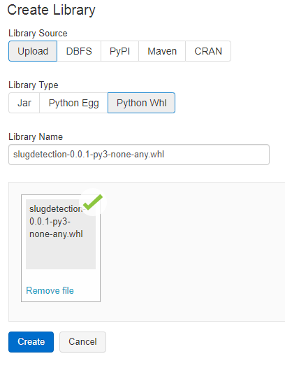

# Independent Research Project
## Package for Automated Slug Detection using Machine Learning 

slugdetection is a Python package created to automatically detect slug flow by classifying pressure and temperature data intervals. The package Slug_Detection module classifies with over 95% accuracy interval and presents a robust approach to labelling slug flow. Other functionalities include forecasting slug flow using times series modelling in the Slug_Forecasting module and clustering flow types together through the Slug_Labelling module.

## Author 

Deirdree A. Polak

Github: dapolak

Email: deirdree.polak@gmail.com

CID: 00973185

## Project Information

This package was developped as part of the Independant Research Project ACSE-9 module for the Applied Computational Sciences and Engineering MSc 2018-19 at Imperial College London and as part of an internship at Wintershall Dea GmbH in Germany.

It was performed under the supervision of Prof Olivier Dubrule and Lukas Mosser from the Royal School of Mines, Imperial College London anf of Dr Meindert Dillen and Peter Kronberger from the Digital Transformation departement at Wintershall Dea GmbH. 

## Repository Structure


## Installation

### Local Installation

Clone the repository to your device using the following line:

```bash
git clone https://github.com/msc-acse/acse-9-independent-research-project-dapolak.git
cd acse-9-independent-research-project-dapolak
```

You can then use and run the package from a .py or Python notebook.

### DataBricks Installation

In the context of using the package in DataBricks to access the data, the wheel file `.whl` in the `\dist` folder is to be downloaded.

In the WorkSpace tab of DataBricks, preferably in the same folder as your Python notebook, right click and select `Create>Library`. In the Create Library page, select `Upload` and `Python Whl` as shown below. The slugdetection package is now saved as a library on your local FileStores

<p align="center">
  
</p>

<p align="center">
  
</p>


There are two options from there. You must copy past the path to the library in the FileStore, by clicking Copy in the Source section and use the path to:
- If admnistrator rights for the cluster you're running your notebook on are granted, you can install the library directly onto your cluster
- Else, you can install the library onto your notebook directly by running the following code. Note that the cluster used cannot be optimised for ML in order for this code to run:

```python
if "-ml-" not in runtime:
  dbutils.library.install("dbfs:/FileStore/.../slugdetection.whl") # FileStore location and name of package
  dbutils.library.restartPython()
```

## Usage

Once the package is installed locally or on Databricks, it can simply be imported and used as shown below.

```python
from slug_detection import *

de = Data_Engineering(spark_data)
sl = Slug_labelling(spark_data)
fr = Flow_Recognition(spark_data)
sd = Slug_Detection(spark_data)
sf = Slug_Forecasting(pands_whp_data)
```

More information about the various functionalities of the package can be found in the `IRP_slugdetection_2019` Python notebook. 

## Data

For confidentiality reasons, the data used to develop and test the package cannot be provided on this repository. The data used is raw pressure and temperature sensor data from an offshore oil well exhibiting slugging behaviour. Unfortunately, the code cannot be run without the data. A live demonstration can be arranged if required for assessment. 

## Requirements

The requirements are listed in `requirements.txt` and can be installed locally using the command:

```bash
pip install -r requirements.txt
```

On DataBricks, all the librairies are already installed on the ML clusters. If version upgrades are required run code
```python
dbutils.library.installPyPI("pypipackage", version="version")
```

## License

This package is licensed using a 
[MIT](https://choosealicense.com/licenses/mit/)
